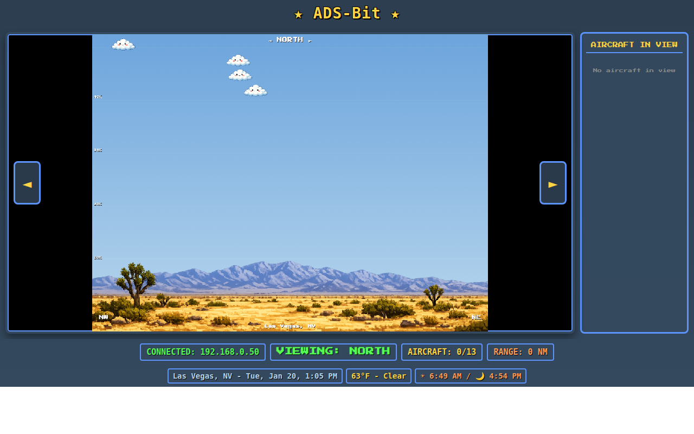

# ADS-Bit

A retro SNES-style side-view flight tracker that displays ADS-B aircraft data with custom pixel art sprites.



## Features

- Real-time aircraft tracking via ADS-B receivers
- Custom pixel art sprites for 6 aircraft types (small prop, regional jet, narrow body, wide body, heavy, helicopter)
- Animated sun and moon with accurate astronomical positions
- Dynamic sky colors based on time of day
- Weather visualization with cloud sprites
- Directional view (N/E/S/W) with themed backgrounds
- Auto-discovery of ADS-B receivers on your network
- Canvas-based 10 FPS retro rendering
- Admin panel with password authentication
- First-run setup wizard

## Quick Start

```bash
# Clone the repository
git clone https://gitea.chops.one/allen/ADS-Bit.git
cd ADS-Bit

# Install dependencies
pip install -r requirements.txt

# Start the server
python3 server.py
```

On first run, visit http://localhost:2001 and the setup wizard will guide you through configuration.

## Requirements

- Python 3.8+
- ADS-B receiver providing SBS/BaseStation format on port 30003 (dump1090, readsb, etc.)
- Modern web browser with Canvas support

## Configuration

ADS-Bit uses a first-run setup wizard to configure your installation. You can also edit `config.json` directly:

```json
{
  "receivers": "AUTO",
  "receiver_port": 30003,
  "location": {
    "name": "My Location",
    "lat": 36.2788,
    "lon": -115.2283
  },
  "web_port": 2001,
  "theme": "desert"
}
```

**Important:** Set your `location.lat` and `location.lon` for accurate weather and sun/moon positioning.

See [CONFIG.md](CONFIG.md) for full configuration options including custom backgrounds and running as a service.

## Controls

- **Arrow Keys / A/D**: Rotate view direction
- View cycles through North, East, South, West
- Click aircraft in sidebar to highlight

## Aircraft Types

| Type | Detection |
|------|-----------|
| Helicopter | Low altitude + slow speed |
| Heavy (747/A380) | High altitude or specific callsigns |
| Wide Body | Very high altitude/speed |
| Narrow Body | Default commercial |
| Regional Jet | Regional carrier callsigns or lower altitude |
| Small Prop | N-prefix callsigns or very low/slow |

## Custom Backgrounds

Create backgrounds for your location:

1. Add 4 directional images to `backgrounds/custom/` (north.png, east.png, south.png, west.png)
2. Set `"theme": "custom"` in config.json
3. Restart the server

See [CONFIG.md](CONFIG.md) for image specifications and tips.

## Running as a Service

To auto-start on boot, see the systemd service instructions in [CONFIG.md](CONFIG.md#running-as-a-service-auto-start).

## Compatible Receivers

Works with any receiver providing SBS/BaseStation format on port 30003:
- dump1090 / dump1090-fa / dump1090-mutability
- readsb
- ADS-B Exchange feeders
- FlightAware PiAware
- Any SBS1 compatible receiver

## License

MIT License - see [LICENSE](LICENSE) for details.

## Credits

- Aircraft and environment sprites generated with AI assistance
- Weather data from [Open-Meteo](https://open-meteo.com/) (free, no API key required)
